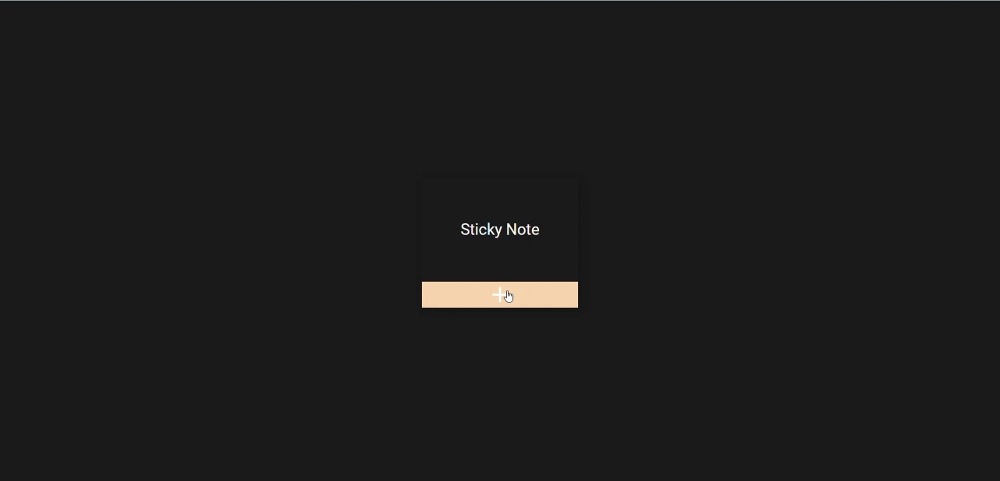
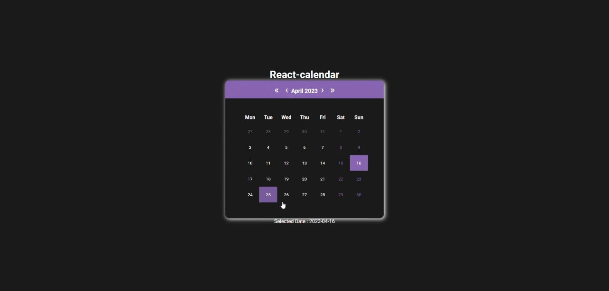
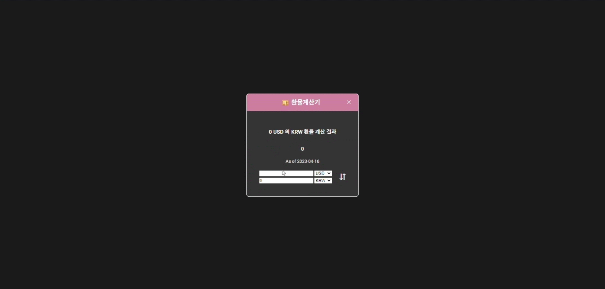
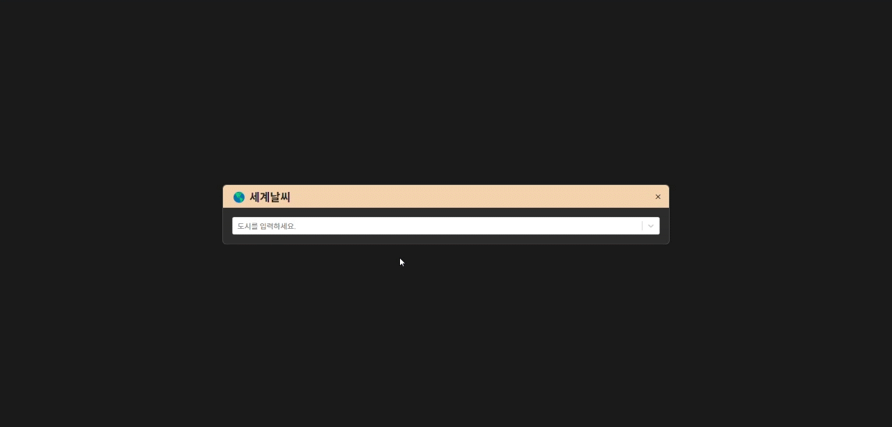

# Team Project

## Description

 

`1. 프로젝트명`

> PUR (Practical and Useful projects using in Real-life)  
> [PUR 실행하기](https://yejin-han.github.io/team_project/)

 

`2. 협업자`

> * 강지연 ([Kang Jiyeon's github](https://github.com/Kang-Jiyeon))
> * 한예진 ([Han Yejin's github](https://github.com/Yejin-Han))

 

`3. 제작기간`

> 2023.02.04 ~ 2023.03.18 (중지, 추후 재개 예정)

 

`4. 활용 Front-end 기술`

>      

 

`5. 요약`

> * 9개의 사이드프로젝트 + 그에 대한 평가 및 코멘트를 남길 수 있는 페이지
> * 바탕화면의 아이콘처럼 배치하여 그 자리에서 활용할 수 있는 SPA(Single Page Application)
> * 다양한 React 패키지 활용

 
 

## About Project

### `Main` (미완)
- 실행화면

- 작업자 : 한예진
- 설명
  - App.js에 만들어진 각 Route로 연결되는 아이콘들이 모여있는 메인화면입니다.
  - 별들과 별의 컨테이너를 useRef로 가져와서 동기적인 useLayoutEffect hook을 통해 별들이 화면 가운데를 중심으로 돌고 있는 것처럼 보이는 애니메이션을 배경에 주었습니다.

 

### `Memo`
- 실행화면

- 작업자 : 강지연
- 설명

 

### `Calendar`
- 실행화면

- 작업자 : 강지연
- 설명

 

### `Paint`
- 실행화면

- 작업자 : 한예진
- 설명
  - 그리기, 배경 채우기, 지우개, 펜 두께 선택, 색상 선택, 전체 지우기, png 파일로 저장하기, 배경이미지 열기의 기능이 있는 그림판입니다.
  - Tools.js에서는 각종 마우스이벤트를 통해 그림을 그리는 useOnDraw 함수를 만들어 export하였고, Tools 컴포넌트에서 drawing state(펜 기본세팅), clearCanvas(전체 지우기) 함수, saveToImg(이미지로 저장하기) 함수, openImg(이미지 열기) 함수, handleDrawing(고르는 요소에 따라 drawing state가 변화함) 함수를 만들었고 본격적으로 필요한 모든 컴포넌트를 return합니다.
  - Canvas.js에서는 canvas element를 참조하여 활용할 수 있도록 하였으며, canvas에 그림을 그릴 수 있는 context2D에 관한 함수들이 정의되어 있습니다. 또한 Tools에서 export한 useOnDraw 함수를 활용하여 실제로 Canvas.js에서 정의한 onDraw 함수를 실행할 수 있도록 하였고, 여기서 canvas element를 return합니다.
  - Brush.js는 Tools의 select의 옵션에 따라 Tools의 drawing state의 weight를 결정하는 컴포넌트입니다.
  - Colors.js는 우선 colorList 배열을 만들고 map하여 컬러 팔레트를 나타냈고, 옆에는 color picker까지 두어 자유롭게 Tools의 drawing state의 color를 결정하는 컴포넌트입니다.
  - Items.js는 펜, 물통, 반짝이(지우개 대신) 이모지를 클릭하여 Tools의 drawing state의 tool을 결정하는 컴포넌트입니다.

 

### `Calculator`
- 실행화면

- 작업자 : 한예진
- 설명
  - 일반모드 계산기입니다.
  - Calculator.js에서 버튼에 들어갈 내용을 Values 배열에 담아 버튼 안에 일일이 내용을 넣지 않고 map 함수를 이용하여 value값으로 넘겨주었습니다.
  - CalcContext.js에서 createContext와 Provider를 이용하여 버튼을 누를 때마다 연산에 사용될 공통 state인 calc를 정의하였습니다.
  - Keypads.js에서 각 버튼의 스타일을 담은 클래스명을 변수로 부여하였고, Keypads 컴포넌트에서 각 버튼마다 연산에 사용할 함수를 정의하고 지정하였습니다. 각 함수들은 위의 calc state를 통한 연산을 정의한 함수입니다.
  - Screen.js는 useContext를 활용하여 calc state를 불러와 그 값을 통해 누른 버튼의 값과 연산결과 값, 중간 과정을 보여주는 컴포넌트입니다.

 

### `Currency Convertor`
- 실행화면

- 작업자 : 강지연
- 설명

 

### `Weather`
- 실행화면

- 작업자 : 한예진
- 설명
  - geoDB와 openweathermap의 API를 활용하였습니다.
  - getAPI.js에서 env로 넘긴 API key를 불러와서 변수로 export합니다.
  - Weather.js에서 current, forecast state를 설정, fetch한 날씨 데이터를 동기적으로 처리하여 current, forecast state로 set합니다.
  - Search.js에서 fetch한 geo 데이터를 가지고 react-select-async-paginate 패키지를 이용하여 키보드 입력 데이터에 대한 예측 도시를 5개까지 출력해줍니다.
  - CurrentWeather.js는 오늘의 날짜, 온도, 최대 온도, 최소 온도, 체감 온도를 state로 받아 출력합니다. 요일은 switch문으로 처리하여 한글로 보여줍니다.
  - Forecast.js는 하루를 3시간 단위로 나누어 현재 시간이 어디에 속하냐에 따라 그 전 3시간 ~ 24시간의 예상 날씨 정보를 알려줍니다. 이 때, react-accessible-accordion 패키지를 활용하여 세부 날씨 정보를 아코디언 메뉴로 보여줍니다.

 

### `Clock` (미완)
- 실행화면
- 작업자 : 강지연
- 설명

 

### `Account Book` (미완)
- 실행화면
- 작업자 : 한예진
- 설명

 

### `Feedback Page` (미완)
- 실행화면
- 작업자 : 한예진
- 설명

 

***

### References

- [그림판 참고영상1](https://www.youtube.com/watch?v=GpAIlGRfl_8)
- [그림판 참고영상2](https://www.youtube.com/watch?v=kIdChhMSkgA)
- [계산기 참고영상1](https://www.youtube.com/watch?v=t6jxqGQduWk&t=1158s)
- [계산기 참고영상2](https://www.youtube.com/watch?v=o89bhL-S6g8)
- [날씨 참고영상](https://www.youtube.com/watch?v=Reny0cTTv24&t=554s)
